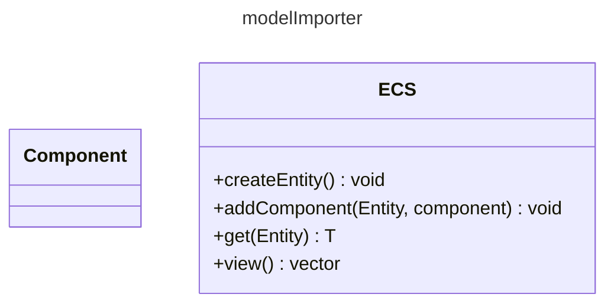
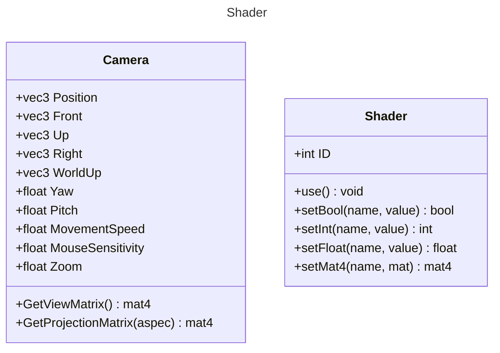

## uml

👷👷👷👷建設中👷👷👷👷

```mermaid
---
title: modelImporter
---
classDiagram
class Component {
    
}
class ECS {
    +createEntity() void
    +addComponent(Entity, component) void
    +get(Entity) T
    +view() vector<Entity> 
}
```

---

```mermaid
---
title: Shader
---
classDiagram
    class Camera{
        +vec3 Position
        +vec3 Front
        +vec3 Up
        +vec3 Right
        +vec3 WorldUp

        +float Yaw
        +float Pitch
        +float MovementSpeed
        +float MouseSensitivity
        +float Zoom

        +GetViewMatrix() mat4
        +GetProjectionMatrix(aspec) mat4

    }
class Shader{
        +int ID
        +use() void
        +setBool(name, value) bool
        +setInt(name, value) int
        +setFloat(name, value) float
        +setMat4(name, mat) mat4
    }
```
